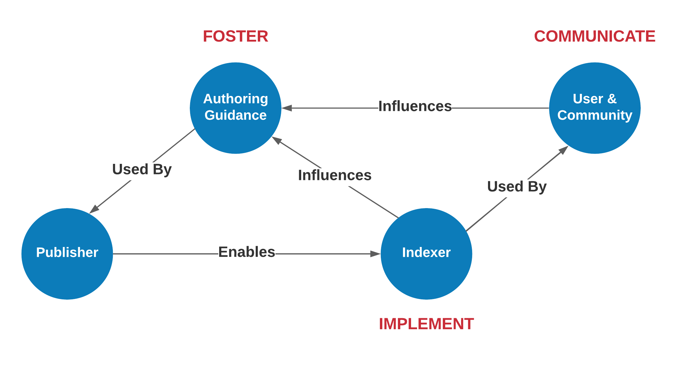

# Archetype

## About

About During the design process of a community knowledge graph, many of the design
approaches leverage three personas that help define the various archetypes. 
It should not be assumed these scope all the
potential persona or that a person or organization scope only one. 
These are simple design approaches representing potential
models or characters. 

### Persona: Publisher 

The Publisher is engaged authoring the JSON-LD
documents and publishing them to the web. This persona is focused on describing
and presenting structured data on the web to aid in the discovery and use the
resources they manage. Details on this persona can be found in the Publisher
section. Additionally, this persona would be leveraging this encoding described
in the JSON-LD Foundation section and the profiles described in the Thematic
Patterns.

### Persona: Aggregator 

The Aggregator is a person or organization who is
indexing resources on the web using the structured data on the web patterns
described in this documentation. Their goal is to efficiently and efficiently
index the resources exposed by the Publisher persona and generate usable
indexes. Further, they would work to expose these indexes in a manner that is
usable by the User persona.  

### Persona: User 

The user is the individual or community who wished to leverage the
indexes generated as a result of the publishing and aggregation activities. The
user may be using the developed knowledge graph or some web interface built on
top of the knowledge graph or other index. They may also use query languages
like SPARQL or other APIs or even directly work with the underlying data
warehouse of collected data graphs.

User tools may be websites or scientific notebooks. Some examples of these user
experiences are described in the User section.

## Activity Flow

A rough draft of the activity flow.

## Relations

## References

* https://github.com/ESIPFed/science-on-schema.org/tree/master/guides
* [Schema.org for research data managers: a primer
](https://www.inderscienceonline.com/doi/10.1504/IJBDM.2022.128449)
* Data on th web W3c
* [Science on Schema](https://github.com/ESIPFed/science-on-schema.org//)
* [Ocean Best Practices on Schema](https://github.com/adamml/ocean-best-practices-on-schema)
