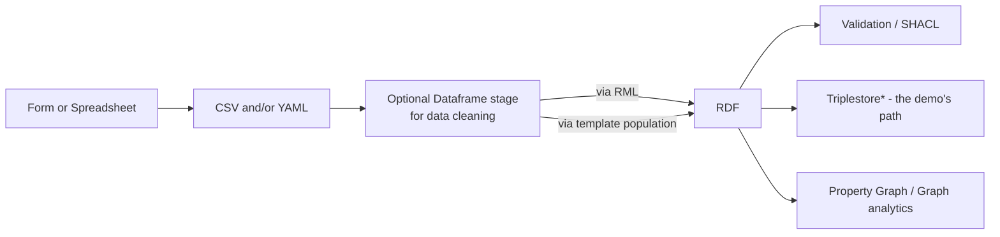

---
# try also 'default' to start simple
theme: seriph
# random image from a curated Unsplash collection by Anthony
# like them? see https://unsplash.com/collections/94734566/slidev
background: https://cover.sli.dev
# some information about your slides, markdown enabled
title: JSON-LD from semi-structured data
 
# apply any unocss classes to the current slide
class: text-center
# https://sli.dev/custom/highlighters.html
highlighter: shiki
# https://sli.dev/guide/drawing
drawings:
  persist: false
# slide transition: https://sli.dev/guide/animations#slide-transitions
transition: slide-left
# enable MDC Syntax: https://sli.dev/guide/syntax#mdc-syntax
mdc: true
---

# JSON-LD 
# from semi-structured data

A presentation of options

<div class="pt-12">
  <span @click="$slidev.nav.next" class="px-2 py-1 rounded cursor-pointer" hover="bg-white bg-opacity-10">
    Press Space for next page <carbon:arrow-right class="inline"/>
  </span>
</div>

<div class="abs-br m-6 flex gap-2">
  <button @click="$slidev.nav.openInEditor()" title="Open in Editor" class="text-xl slidev-icon-btn opacity-50 !border-none !hover:text-white">
    <carbon:edit />
  </button>
  <a href="https://github.com/slidevjs/slidev" target="_blank" alt="GitHub" title="Open in GitHub"
    class="text-xl slidev-icon-btn opacity-50 !border-none !hover:text-white">
    <carbon-logo-github />
  </a>
</div>

<!--
The last comment block of each slide will be treated as slide notes. It will be visible and editable in Presenter Mode along with the slide. [Read more in the docs](https://sli.dev/guide/syntax.html#notes)
-->

---
transition: fade-out
---


# Boundary Conditions

### Context

- starting with CSV or Forms based input exported to CSV or YAML
- python as the base language where possible

<br>
<hr>
<br>

### Principle(s)

- avoid lock in: Planned migration to other approaches

<br>
<hr>
<br>

### Goal(s)

- Sustainable self-hosted approaches
- Focus on established languages and libraries 


---
transition: fade-out
---

 
# Ecosystem

This is a simple and not exhaustive review of tools and approaches for ETLs to RDF

- [W3C Wiki for ConverterToRDF](https://www.w3.org/wiki/ConverterToRdf)
- [Github search for convert CSV to RDF](https://github.com/search?q=convert%20CSV%20to%20RDF&type=repositories)
- [LinkML](https://linkml.io/) general purpose modeling language
- [SchemaSheets](https://github.com/linkml/schemasheets) focus on wide data in spreadsheets, uses LinkML
- [OpenRefine](https://openrefine.org/)
- [Any23](https://attic.apache.org/projects/any23.html)  now in Apache Attic

<br>

__Focus on these__

- RML based  [rml.io](rml.io) a superset of [W3C R2RML](https://www.w3.org/TR/r2rml/) 
- [Morph-KGC](https://github.com/morph-kgc/morph-kgc)
- Code with templates ([Jinja2](https://jinja.palletsprojects.com/en/3.1.x/))

<!--
You can have `style` tag in markdown to override the style for the current page.
Learn more: https://sli.dev/guide/syntax#embedded-styles
-->

<style>
h1 {
  background-color: #2B90B6;
  background-image: linear-gradient(45deg, #4EC5D4 10%, #146b8c 20%);
  background-size: 100%;
  -webkit-background-clip: text;
  -moz-background-clip: text;
  -webkit-text-fill-color: transparent;
  -moz-text-fill-color: transparent;
}
</style>
 
---
transition: fade-out

---

# Profiles 1/2
[Science on Schema.org (SOSO)](https://github.com/ESIPFed/science-on-schema.org/blob/master/guides/Dataset.md)

This is also what the UNESCO ODIS [Ocean InfoHub Project](https://oceaninfohub.org/project-overview/) is using.  

```json  
{
  "@context": {
    "@vocab": "https://schema.org/"
  },
  "@type": "Dataset",
  "name": "Removal of organic carbon by natural bacterioplankton communities ...",
  ...
  "variableMeasured": [
    {
      "@type": "PropertyValue",
      "name": "latdd",
      "alternateName":"latitude, decimal degrees",
      "propertyID":"http://purl.obolibrary.org/obo/NCIT_C68642",
      "description": "Latitude where water samples were collected ...",
    },
    ...
  ]
}

```
 

---
transition: fade-out

---

# Profiles 2/2

> SOSO pattern used in OIH [Essential Ocean Variables](https://book.oceaninfohub.org/thematics/variables/index.html) approach. 

> [CODATA CDIF](https://worldfair-project.eu/cross-domain-interoperability-framework/) is lookin at [https://schema.org/StatisticalVariable](https://schema.org/StatisticalVariable)

<br>
 
```json  
 "variableMeasured": [
        {
            "@type": "PropertyValue",
            "name": "Sea State",
            "description": "Sea State is the characterization of wave and swell, typically in terms of height, wavelength, period, and directional wave energy flux ",
            "propertyID": [
                "http://purl.obolibrary.org/obo/ENVO_01001374",
                "https://gcmd.earthdata.nasa.gov/KeywordViewer/scheme/all/11aca777-8a01-42ce-b076-b3059c3d8cae?gtm_keyword=SEA%20STATE&gtm_scheme=Earth%20Science"
            ]
        },
        {
            "@type": "PropertyValue",
            "name": "Ocean Surface Stress",
            "description": "The 2-dimensional horizontal vector Ocean Surface Stress is the rate per unit area at which momentum is transferred from the atmosphere to the ocean.",
            "propertyID": "http://purl.obolibrary.org/obo/ENVO_01001844",
            "value": 0.2,
            "unitCode": "http://qudt.org/vocab/unit/N-PER-M2"
        }
    ],

```

---
transition: fade-out

---


# Workflow

Just a quick overview of the workflow

<div class="grid grid-cols-8 gap-5 pt-4 -mb-6">
 


 


</div>

---
foo: bar
dragPos:
  square: 691,33,167,_,-16
---


# Notebook

Let's transition to the notebook