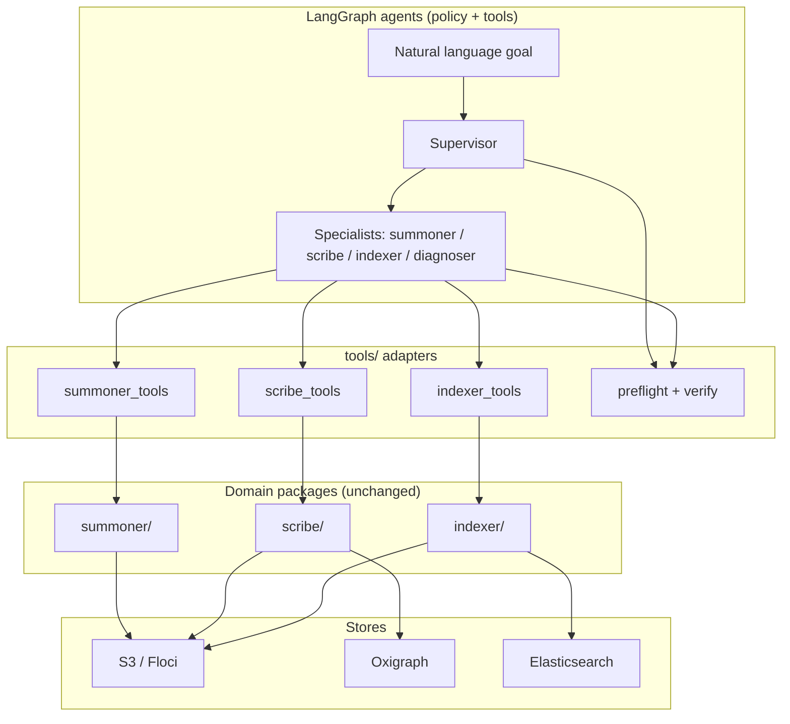
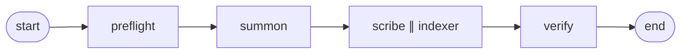
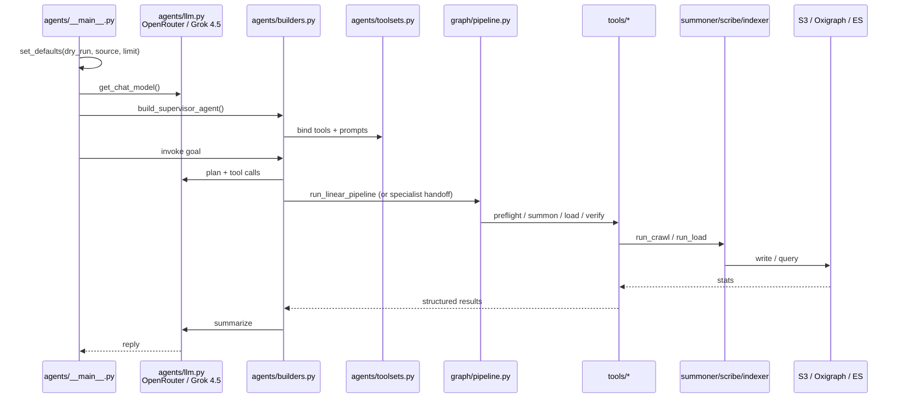

# LangGraph on the MVP pipeline

What the LangGraph approach adds to this workflow, and which files implement it.

---

## What LangGraph is giving this workflow

### What you already had (without LangGraph)

Three solid Python packages and CLIs:

```text
python -m summoner  →  S3
python -m scribe    →  Oxigraph
python -m indexer   →  Elasticsearch
```

That is the **domain engine**: harvest, convert, load, verify. It works fine if a human (or a shell script) always knows which stage to run, with which flags, and how to interpret failures.

### What LangGraph adds

LangGraph is **not** replacing summoner/scribe/indexer. It sits **on top** as an orchestration + decision layer:



Concretely, you get five things a bare CLI workflow does not:

### 1. Goal-oriented control, not only step lists

Instead of remembering:

```bash
python -m summoner --source medin --limit 3
python -m scribe --source medin
python -m indexer --source medin
# then curl SPARQL / ES…
```

you can say:

> “Full real pipeline for medin limit 3; verify graph and index.”

The **supervisor** decides: preflight → summon → scribe → indexer → verify (or hand off to specialists). That is the difference between *running a recipe* and *delegating a goal*.

### 2. Composable tools with structured results

Each capability is a **tool** that returns JSON-ish stats the model can reason over:

- “S3 has 3 objects” → safe to load
- “Oxigraph connection refused” → diagnose, don’t claim success
- dry-run vs real write is an **argument**, not a separate script

So the agent can branch: empty S3 → don’t load; dry-run → no CLEAR/replace; verify after write.

### 3. Specialists with different policies

| Agent | Judgment it encodes |
|-------|---------------------|
| Summoner | robots, headless, limits, polite crawl |
| Scribe | CLEAR graph warning, PROV expectations |
| Indexer | replace-index warning, facade fields |
| Diagnoser | read-only first, map symptoms → causes |
| Supervisor | route goals, prefer dry-run unless asked |

That policy lives in prompts + tool subsets, not scattered through bash and README.

### 4. Two orchestration modes

| Mode | File | Use |
|------|------|-----|
| **Deterministic linear graph** | `graph/pipeline.py` | Fixed: preflight → summon → scribe∥indexer → verify. No LLM required for the path itself. |
| **Supervisor multi-agent** | `agents/builders.py` + `graph/supervisor.py` | LLM routes: “diagnose only”, “reload ES only”, “full pipeline”, handoffs to specialists. |

You can exercise both: pure linear via `run_linear_pipeline`, and supervisor with OpenRouter/Grok.

### 5. Same domain code, safer defaults for agents

Write tools default to **`dry_run=True`**. Agents only write when defaults / CLI say `--no-dry-run` and the model requests real loads. That is a deliberate safety layer for LLM-driven ops.

### What LangGraph is *not*

- Not a new harvester or RDF converter (still summoner/scribe/indexer).
- Not required for demos you can run by hand.
- Not magic reliability: wrong goals, down services, or bad source data still fail—but failures are structured and diagnosable.

**In one line:** LangGraph turns the MVP pipeline from “scripts a human runs in order” into “capabilities an agent can choose, compose, and explain.”

---

## Key files leveraged for the LangGraph approach

### Layer A — Domain packages (unchanged engines)

| Path | Role |
|------|------|
| `summoner/` | Sitemap → JSON-LD → S3 (`run_crawl`) |
| `scribe/` | S3 → N-Quads + PROV → Oxigraph (`run_load`) |
| `indexer/` | S3 → ES facade docs (`run_load`) |
| `mvp_config.yaml` | S3 / Oxigraph / ES / sources |
| `build/docker-compose.*.yaml` | Local Floci, Oxigraph, ES, Browserless |

LangGraph **calls into** these; it does not reimplement them.

---

### Layer B — Tools (callable “skills”)

Thin adapters: plain Python functions → LangChain tools → agent tool-calls.

| File | What it wraps |
|------|----------------|
| `tools/summoner_tools.py` | extract, sitemap inspect, `summon_source` |
| `tools/scribe_tools.py` | list S3, convert N-Quads, PROV preview, **`load_oxigraph`** |
| `tools/indexer_tools.py` | search facade build, **`load_elasticsearch`** |
| `tools/preflight.py` | service pings, list sources |
| `tools/verify_tools.py` | SPARQL counts, ES `_count` |
| `tools/_util.py` | config path, ok/err result shape |
| `tools/__init__.py` | public exports |

**Triplestore load specifically:** `tools/scribe_tools.py` → `scribe.load.run_load` → Oxigraph.

---

### Layer C — Agents (policy + tool binding + LLM)

| File | Role |
|------|------|
| `agents/llm.py` | OpenRouter client; default model **`x-ai/grok-4.5`** |
| `agents/defaults.py` | Injected `config_path`, `source`, `limit`, `dry_run` |
| `agents/toolsets.py` | `@tool` wrappers + tool subsets per specialist |
| `agents/builders.py` | Build summoner/scribe/indexer/diagnoser + **supervisor with handoffs** |
| `agents/prompts/*.md` | System prompts (policy text) |
| `agents/__main__.py` | CLI: `python -m agents "…"` |

Prompts are the “skills” as instructions; tools are the skills as execution.

---

### Layer D — Graph orchestration

| File | Role |
|------|------|
| `graph/state.py` | `PipelineState` (source, dry_run, stats, errors, stages) |
| `graph/pipeline.py` | Linear nodes; optional LangGraph compile; parallel scribe∥indexer |
| `graph/supervisor.py` | `run_supervisor` / multi-agent entry |
| `graph/__main__.py` | CLI: `python -m graph --dry-run …` |

Linear pipeline shape:



---

### Layer E — Support

| File | Role |
|------|------|
| `requirements-agents.txt` | langgraph, langchain, langchain-openai |
| `tests/test_agents_*.py`, `tests/test_tools_*.py`, `tests/test_graph_*.py` | Offline construction + pure tools |
| `README.md` | Operator docs for both paths |

---

## Mental model of a request

When you run:

```bash
python -m agents --agent supervisor --source medin --limit 3 --no-dry-run \
  "Full real pipeline…"
```

roughly:



1. **`agents/__main__.py`** — parse flags, `set_defaults(dry_run=False, …)`
2. **`agents/llm.py`** — ChatOpenAI → OpenRouter → Grok 4.5
3. **`agents/builders.py`** — supervisor + specialist graphs; tools from **`toolsets.py`**
4. Supervisor calls **`run_linear_pipeline`** (or handoffs)
5. **`graph/pipeline.py`** nodes call **`tools/*`**
6. Tools call **`summoner` / `scribe` / `indexer`**
7. Data lands in **Floci / Oxigraph / ES**; verify tools confirm

---

## When to use which path

| Situation | Prefer |
|-----------|--------|
| Fixed demo / CI / known steps | `python -m graph` or raw `python -m summoner\|scribe\|indexer` |
| “What’s wrong?”, mixed goals, NL ops | `python -m agents` (supervisor / diagnoser) |
| Extending harvest/RDF/ES logic | Edit domain packages only |
| Extending agent behavior | Tools + prompts + graph, not core harvest code |

That separation is the main architectural win: **domain code stays testable and CLI-simple; LangGraph owns choice, composition, and operator dialogue.**

---

## Quick commands

```bash
# Agent stack deps
pip install -r requirements-agents.txt
export OPENROUTER_API_KEY=sk-or-...

# Deterministic pipeline (no LLM for control flow)
python -m graph --source medin --limit 3 --dry-run
python -m graph --source medin --limit 3 --no-dry-run

# Multi-agent supervisor (OpenRouter / x-ai/grok-4.5)
python -m agents --show-config
python -m agents --agent supervisor --source medin --limit 3 --dry-run \
  "Dry-run the medin pipeline and summarize"
python -m agents --agent diagnoser "List S3 for medin and check graph/index counts"
```

See also [README.md](./README.md) (pipeline overview) and [QUICKSTART.md](./QUICKSTART.md) (services + first run).
