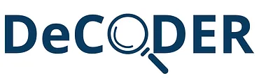

# Structured Data on the Web and the UN Ocean Decade

> Note:  This material is being prepared for a Dec 14th 2023 talk. So
> they are still in development (likely till Dec 13th) ;-)

## Introduction

In this session, we'll explore leveraging structured data on the web to establish a knowledge graph serving as a
comprehensive master data catalog for community resources. The discussion will showcase various strategies for
generating data productions that align with community objectives.

All this is done in the context of the UN Ocean Decade and this approach
demonstrates how a group could become a contributor to the Ocean Decade.
We will discuss the [ODIS Ocean InfoHub (OIH)](https://oceaninfohub.org/project-overview/)
as an example these approaches in development. This is also related to the
work of the [NSF funded DeCODER project](https://www.earthcube.org/decoder) and for this talk we will use
resource assocated with the
[Deep Ocean Observing Stragety (DOOS)](https://www.deepoceanobserving.org/).

| UNESCO / ODIS / Ocean InfoHub                                                                                             | National Science Foundation: DeCODER                                      |
|---------------------------------------------------------------------------------------------------------------------------|---------------------------------------------------------------------------|
|  |  |

Additionally, we'll delve into techniques for validating and analyzing this knowledge graph, framing these components as
part of a conceptualized "implementation network" akin to the principles outlined in the GoFAIR approach and developing
data products based on the resources described in the knowledge graph.

### Implementation Network

This approach is __not__ an instance of
a [FAIR Implementation Network](https://www.go-fair.org/implementation-networks/),
however, there are some similarities that make it worth raising the comparison.

The following image highlights some of the interactions between three personas; _Publisher_, _Indexer_ and _User and
Community_.
These are described in More detail in the [Personas Section](../../personas/README.md).  The primary goal here is to highlight that this is a __melding of social and technical elements__ into a continuous workflow. 

# Demonstration

> GOAL: As part of this demo we will use open source tools to index JSON-LD from the web and 
> form a Knowledge Graph.  We will then use that graph to form new products and interact with them.

> NOTE:  What follows is the "project" part of the _Principles over Project_ approach above. Therefore, 
> we are now being prescriptive about how we implement the "principles"

> NOTE: The goal is that this demo can be run with the only pre-requisites
> being Docker, the ability to run command line scripts and optionally the ability to run
> Jupyter notebooks 

> NOTE:  see the [appendix](appendix.md) for other more detailed resources on the topic of authoring
> and structuring JSON-LD.  We will only touch on it briefly here.

## Set up our environment

* Introduction to our tool selection: [GleanerIO](https://github.com/gleanerio)
* Define our sources 
    - identify our sources and show configuration files for gleaner and nabu
* Set up our run environment
    - docker compose 
      - Minio
      - Oxigraph
      - Headless Chrome

## Let's just do it

enough talk...  more action...

### Publisher

* [Publishing: JSON-LD Flow](./card_jsonld.md)
* [Publishing: Web Architecture Flow](./card_sources.md)   

### Indexer

* [Indexing Flow](./card_indexer.md)

### Users / Community

* [Data Ops Flow](./card_dataops.md)

## Thanks

* Provide some points of contacts here for some of the projects mentioned

