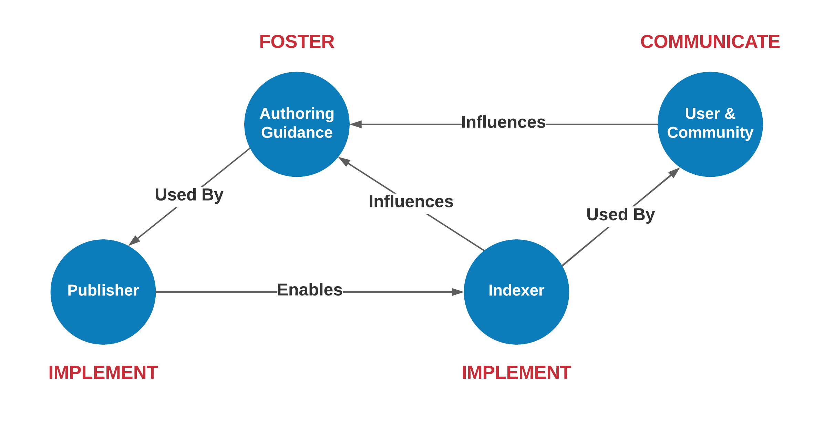

# Structured Data on the Web and the UN Ocean Decade

> Note:  This material is being prepared for a Dec 14th 2023 talk.  So 
> they are still in development (likely till Dec 13th) ;-)

## Introduction

In this session, we'll explore leveraging structured data on the web to establish a knowledge graph serving as a
comprehensive master data catalog for community resources. The discussion will showcase various strategies for
generating data productions that align with community objectives.

All this is done in the context of the UN Ocean Decade and this approach
demonstrates how a group could become a contributor to the Ocean Decade.
We will discuss the [ODIS Ocean InfoHub (OIH)](https://oceaninfohub.org/project-overview/)
as an example these approaches in development. This is also related to the
work of the [NSF funded DeCODER project](https://www.earthcube.org/decoder) and for this talk we will use
resource assocated with the
[Deep Ocean Observing Stragety (DOOS)](https://www.deepoceanobserving.org/).

Additionally, we'll delve into techniques for validating and analyzing this knowledge graph, framing these components as
part of a conceptualized "implementation network" akin to the principles outlined in the GoFAIR approach and developing 
data products based on the resources described in the knowledge graph.

### Implementation Network

This approach is __not__ an instance of a [FAIR Implementation Network](https://www.go-fair.org/implementation-networks/),
however, there are some similarities that make it worth raising the comparison.

We have broken down the following image with the concept of three persona; _Publisher_, _Indexer_ and _User and Community_. 
These are described in More detail in the [Personas Section](../../personas/README.md).

The primary goal here is to highlight that this is a melding of social and tehcnical elements 
into a continuous workflow.  The process helps to sustain engagement in and the sustainability of 
the system.

### Ocean InfoHub & DeCODER

As noted, this work is done in the context of Ocean InfoHub (OIH) and the NSF funded DeCODER work.  
You can find more information on Ocean InfoHub at the [overview page](https://oceaninfohub.org/project-overview/). 
A short introduction to the concept can be seen in the following video.

## This talk as a Three Act Play

We will frame this session along the classic three act play structure.  This will
provide some easy framing of the various elements we will go over. 

### Act I  Problem

How do communities of practice organize their desperate data and research
projects to generate the products and resources to support their goals.
We might call this "addressing FAIR" though that could risk disconnecting
this from specific research goals within a community.

### Act II Solution

Focus on the creation of a knowledge graph as a type of  "master data catalog" and
use that as a foundation to generate data products from. Also, we will explore the
knowledge graph as a foundation to define needed products and iterate/validate the
data workflow to generate those products

### Act III Future

During this phase, I aim to illustrate the potential directions that OIH and DeCODER are exploring. The primary
objective is to produce essential metadata and broad products, facilitating exploration within these domains. The
overarching goal is to empower the utilization of data to address community objectives.

## Boundary conditions

Given this context we can briefly set some boundaries on what
this talk will and will not be about.

### Is not

* A review of structured data on the web, we have those; 
  * [ESIP Summer Meeting 2022](https://github.com/ESIPFed/science-on-schema.org/tree/226-esip-summer-mtg-2022-tutorial/tutorials/esip-summer-mtg-2022) by Adam Shepherd
  * _Schema.org for research data managers: a primer_  https://doi.org/10.1504/IJBDM.2022.128449
* A vocabulary review, see resources such as;
  * [ESIP Science on Schema](https://github.com/ESIPFed/science-on-schema.org//) and https://doi.org/10.5281/zenodo.7872383
  * [Shema.org](https://schema.org/)
  * [Ocean InfoHub Book](https://book.oceaninfohub.org/)
* A review of JSON-LD as a means to serialize knowledge via RDF (a data model) + schema.org (a vocabulary), see;
  * [json-ld.org documentation](https://json-ld.org/learn.html)

### Is

* A description of a socio-technical architecture to address FAIR principles 
* A demonstration of an application of  web architecture as foundation for structured data
  on the web to build knowledge graphs and other data products
* A review of the principles of such an architecture and a reference implementation of those principles

## Approaches

### Principles over projects

Our technical component is introduced as a collection of principles. These principles can be executed through various
implementations or projects. It's crucial to continually direct our attention to these principles rather than the
projects themselves.

### Data in context

It is important to keep the logic in the data to the greatest extent possible. Logic in code is disconnected from the data
and increases the burden of maintaining the generation of the products.

## Activity workflow (finally! the demo )

> Note:  What follows is the "project" part.  Here we are being 
> prescriptive about how we implement the "principles"

> Note: The goal is that this demo can be run with the only pre-requisite 
> being Docker, the ability to run command line scripts and optionally the ability to run 
> Jupyter notebooks

### define our environment and set up our supporting architecture with Docker
* define our tools (GleanerIO)
    - our tools (gleaner, nabu)
    - our system architecture (docker compose for minio, oxigraph,  et al)
    - link to docs
* define our sources (see notes.md)
    - link to configs, use as an example of what to look for
        - both gleaner and nabu
    - show [Ocean Catalog](https://catalogue.odis.org/)
      - Example entry for [BCO-DMO](https://catalogue.odis.org/view/3287)
* set up our run environment via archetype
    - docker compose based  
    - why was archetype made? as a means to quickly test/demonstrate to providers for OIH
* show the data products workflow here to show what we are doing

### Let's just do it

* source selection
    * web architecture approach via sitemaps as a primary source
      * NOTEBOOK: [sitemap_assay.ipynb](../commons/sitemap_assay.ipynb)
    * define configuration
* Gleaner
    * indexing cliGleaner.sh [quickstart](../../docs/quickstart.md)
* Nabu
    * building graphs with cliNabu.sh   [quickstart](../../docs/quickstart.md)
    * release graph concept
        * [OIH Release Graph Development](https://github.com/iodepo/odis-arch/tree/master/graphOps/releaseGraphs)
        * Zenodo plans  [Ocean InfoHub Community](https://zenodo.org/communities/oceaninfohub)
    * load to [Oxigraph](https://github.com/oxigraph/oxigraph)
* Query with SPARQL
    * In oxigraph directly
    * In jupyter with rdflib loading release graphs
        * NOTEBOOK: [sparql.ipynb](../commons/sparql.ipynb)
        * Mention the AWS notebooks here
* Validation
    * NOTEBOOK: [validationSHACL.ipynb](../commons/validationSHACL.ipynb)
        * SHACL validate with SOSO shacl shapes (maybe CDIF and OIH ones too?)
    * Fuji
* Data products from the KG        
    * NOTEBOOK: [mdpLite.ipynb](../commons/mdpLite.ipynb)
        * Using the mdp notebook to build a release product
    * NOTEBOOK: [mdpDuckDB.ipynb](../commons/mdpDuckDB.ipynb)
        * search the release product with duckdb  (notebook)
    * NOTEBOOK: kg2network.ipynb 
        * make a graph network
        * visualize it [example](https://github.com/iodepo/odis-arch/tree/schema-dev-df/graphOps/graphVisualization)
    * NOTEBOOK: mdp2spatial.ipynb 
        * visualize with grids (notebook)
* potential products: discuss here how the catalog can let us tap the variables
  and even the data distributions to marshall data as well.  
  We can form up parquet, geojson, geopackage, OGC geoapi, etc.
  Would be fun to show a query that pulls variables and distribution links to files.
* the future
    * revisit the data workflow diagram, this is where a community
      can being to think about the products needs to address the goals
      desired. Those products may or may not be possible, but this
      flow can help define those that are not enabled now and what is
      needed to realize them.
    * Mention Tom's ML work here
    * CODATA CDIF
    * other sources like geoapi, etc

Thanks
    * points of contact
        * developer contacts DeCODER, OIH, Gleaner (me,Dave, etc)
        * DeCODER (Kenton)
        * OIH (Pier Luigi and Lucy)
