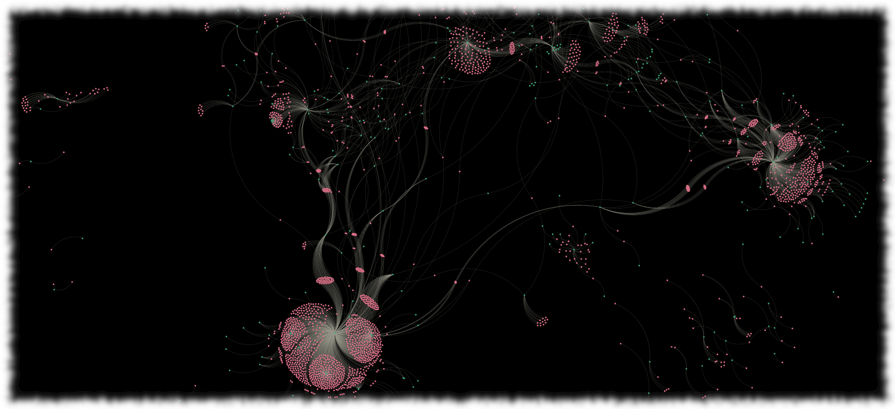

#  Data Ops

## About

Once we have formed a Knowledge Graph (KG), there are many things we can do with it.  
It is, in a manner, a master data catalogue for a community of practice.  

## Details

## Activity

### Query

* In Oxigraph UI (SPARQL examples)
* In jupyter with rdflib loading release graphs
  * __NOTEBOOK:__ [sparql.ipynb](../commons/notebooks/sparql.ipynb)

### Data products from query

Building data products from the KG

* Build an example data product 
  * __NOTEBOOK:__ [mdpLite.ipynb](../commons/notebooks/mdpLite.ipynb)
  * __NOTEBOOK:__ [mdpDuckDB.ipynb](../commons/notebooks/mdpDuckDB.ipynb)  Using DuckDB on a parquet product

### Make a graph network

Convert to a network and visualize it (ref: [ODIS/OIH viz](https://github.com/iodepo/odis-arch/tree/schema-dev-df/graphOps/graphVisualization))

* __NOTEBOOK:__ [networkViz.ipynb](../commons/notebooks/networkViz.ipynb)

### spatial products

* Build a spatial product NOTEBOOK: Note made yet: mdp2spatial.ipynb

