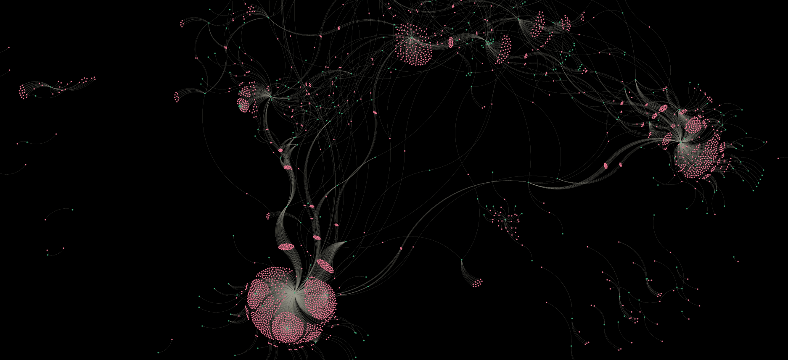

#  Data Ops

## About

about this card

## Details

link to other options to index with like bioschema work or apache approaches
link to bash scripts (note headless issue)
mention why gleaner (testing new idea out)

## Activity

* Query with SPARQL
    * In Oxigraph UI
    * In jupyter with rdflib loading release graphs
        * NOTEBOOK: [sparql.ipynb](../commons/sparql.ipynb)
* Building data products from the KG
    * Build an example data product NOTEBOOK: [mdpLite.ipynb](../commons/mdpLite.ipynb)
    * Demonstrate using DuckDB on a parquet product NOTEBOOK: [mdpDuckDB.ipynb](../commons/mdpDuckDB.ipynb)
    * Convert to a network and visualize it [example](https://github.com/iodepo/odis-arch/tree/schema-dev-df/graphOps/graphVisualization) NOTEBOOK: NOTEBOOK: kg2network.ipynb
    * Build a spatial product NOTEBOOK: mdp2spatial.ipynb
* Emerging activities
    * observatons:  space and time, good descritpions, data models and variables (profiles)
    * CODATA CDIF
    * ML/AI

### make a graph network

### spatial products

### make a _query results product_

- mdp run
- duckdb query on the object

