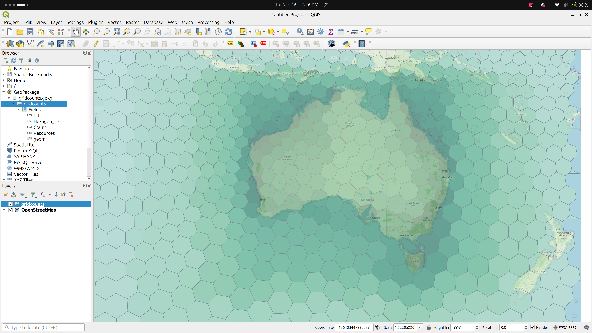

#  Data Ops

## About

Once we have formed a Knowledge Graph (KG), there are many things we can do with it.  
It is, in a manner, a master data catalogue for a community of practice.  

## Details

### Release Graphs

The concept of a citable release graph is being explored at 
["Notebooks and Products related to the OIH Release Graphs"](https://github.com/iodepo/odis-arch/tree/master/graphOps/releaseGraphs).

#### Citation

One outstanding issue here is how to cite such works.  They are really just 
collections of resources on the net.  So credit needs to flow down to the 
actual authoritative body associated with them.  This can be hard when it might
step through multiple steps in a pipeline.  That is, we are not always 
harvesting from the authoritative source.  

How to address these "complex citations" is vital as these are potentially 
good resources for LLM fine-tuning or Retrieval-Augmented Generation (RAG) patterns.

#### PROV

Alongside citation, is the topic of provenance.  Gleaner uses W3C PROV to keep a log
of indexing activities.  This is seen in a separate _prov graph that can be seen in various places.
We also encourage providers to express such information in their graphs leveraging schema.org
types and properties.  Where present we defer to the information provided by our partners.
How we might leverage this to address the citation question above is still in progress in terms
of the architecture and data workflows. 

### Query

* In Oxigraph UI (SPARQL examples)
* In jupyter with rdflib loading release graphs
  * __NOTEBOOK:__ [sparql.ipynb](../commons/notebooks/sparql.ipynb)

### Data products from query

Building data products from the KG

* Build an example data product 
  * __NOTEBOOK:__ [mdpLite.ipynb](../commons/notebooks/mdpLite.ipynb)
  * __NOTEBOOK:__ [mdpDuckDB.ipynb](../commons/notebooks/mdpDuckDB.ipynb)  Using DuckDB on a parquet product

### Make a graph network

Convert to a network and visualize it (ref: [ODIS/OIH viz](https://github.com/iodepo/odis-arch/tree/schema-dev-df/graphOps/graphVisualization))

* __NOTEBOOK:__ [networkViz.ipynb](../commons/notebooks/networkViz.ipynb)

### spatial products

Another activity a person can do is pull the spatial information from the graph
and associate it with discrete grids.  This could be things like S2 or H3 grids.
In this example I am using H3 and the color represents the density of data resources
associated with that grid.  

This is really just another example of leveraing the Knowledge Graph as a type 
of master data catalog from which products can be generatged to address community
interest. 

