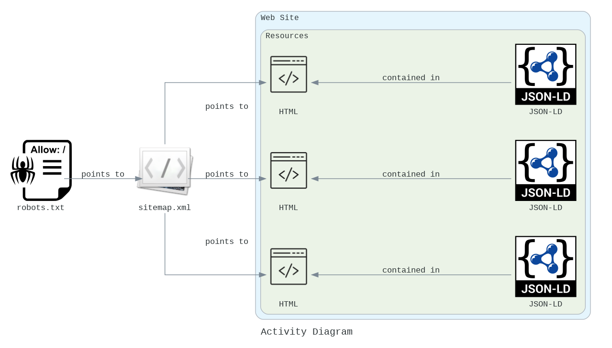
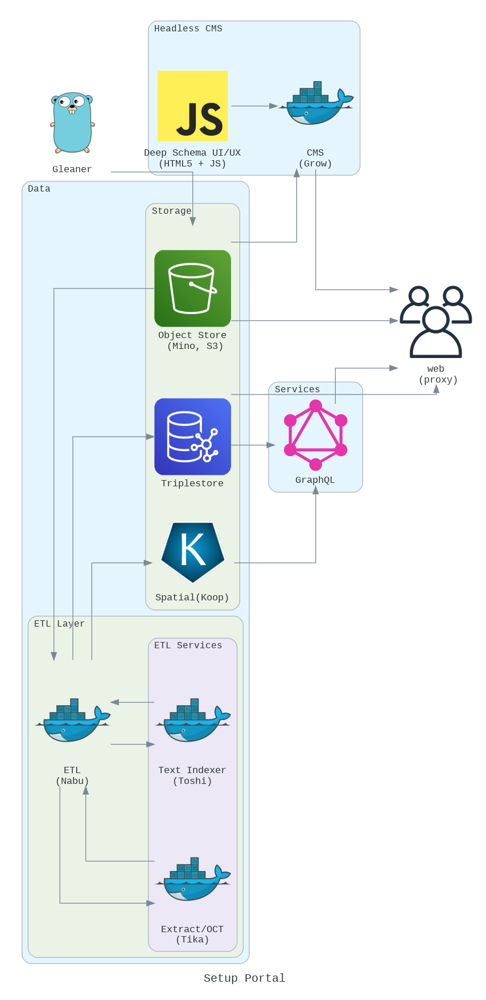
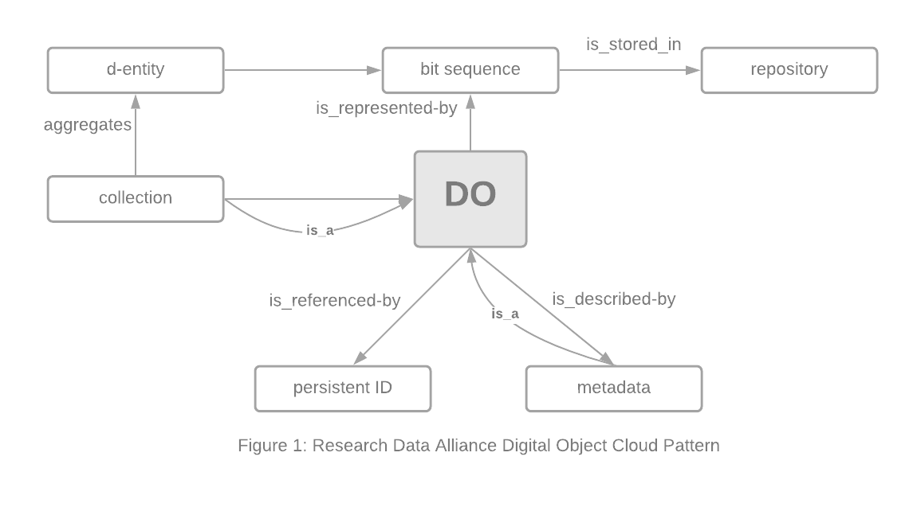

# Gleaner Orchestration Files

[](https://zenodo.org/badge/latestdoi/336542084)


## About

A simple repository to describe the layout of a reference
search architecture and some associated configuration approaches.

## Dependencies

The approach here leverages profiles, so Docker Compose version 1.28 or later is required. 

```
$ docker-compose --profile debug up
```

## Base actions

The basic foundation is the web architecture publishing of resources.
This is done via robots.txt and sitemap.xml implementation.  




## Activity Diagram of Operation

The core activity is the harvesting of the published resources into 
an object store.


## Architecture

This is a simple reference architecture for a search service.  
It scopes the collection of the data from providers via
gleaner and pipes those resources through a system that
implements an approaches influenced by RDA Digital Object Cloud
and GoFAIR Fair Implementation Frameworks (FIF).  

In the end a basic search UI is provided but it is only for
reference for a more detailed and feature rich UI that matches
community needs.

Every element below is optional and can be replaced with
packages that provide similar functionality.   It would be easy, for
example, to implement many elements in a cloud native approach on
AWS, Google Cloud or Azure.  



### Further information

Details of the portal architecture (starting from the upper left in Fig. 6 with the Gleaner) are:

* Picking up from steps in the above activity diagram steps 3, 4 and 5 where Gleaner has fed harvested objects into the object store.
* The extract translate load (ETL) program (Nabu) reads objects and performs the tasks
    * Syncing JSON-LD metadata objects to the triplestore (graph database). These include provider and provenance metadata along with the resources metadata.
  * Processing JSON-LD objects for spatial data (here feed into Koop)
  * Processing JSON-LD objects for a text index (part of the search process)
  * Optional extraction of metadata based on text processing of the data file directly (Tika)
* Search interfaces can be done as SPARQL directly on the graph database or through GraphQL fronted SPARQL.
* A headless CMS provides support for the portal web site as well as the interface for the search capacity.
* Rounding this out is a reverse proxy to expose all these resources to the web.

## Digital Object Patterns

The system uses a DO pattern for objects in the object store that
then evolves into a FAIR Implementation Pattern (a very basic one).




## Configuration

Another section is exploring using [Cue](https://cuelang.org) to 
allow easy generation of the various configuration files for the 
Acme certs, S3 access, bucket paths, etc.   At present, there is
not much there. 


